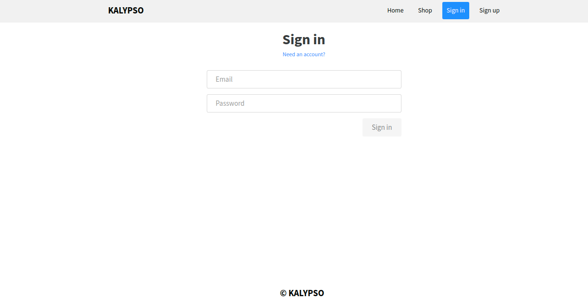

# Angular_Laravel_GinGonic | VICENT COLL Y ALEX ZARAZUA

  <h3 align="center"><strong>KALYPSO APP</strong></h3>

## INDEX

* About this project
* Getting Started
* Preview 
* Features
* Go Packages
* Built With and technologies

         
## About This Project

KalypsoApp is an dockerized application made during the second course of DAW (Development of web applications).

In Kalypso you will be able to can buy clothes from the best brands on the market as well as save the clothes that you like the most to have them saved and be able to buy them when you most want and have them on your profile.
As you make purchases, your karma points will increase, with which you will be able to access many offers and discounts.

## Getting Started

To get the repo running locally:

 * Clone this repo
 * Install Docker Community Edition
 * ` docker-compose up --build `

## Preview

  * **Products Shop List**

    

  * **List Product Description**

      

  * **Register**

     

  * **Login**

    

## Features

| Page | Features |
| - | - |
| Home | Brands with Laravel and MySql  |
| Shop | List with Laravel and MySql, Details with Laravel and MySql |
| Settings | LogOut and  User Settings |
| Profile | User info, favourited Garment |

 

| Service | Features |
| - | - |
| Register | Regular register |
| Login | Regular login |
| Favourites | Favourite button in each garment , favourited show up on profile  |

 

| Techical Feature | Where it works |
| - | - |
| Docker | Entire application is dockerized |
| Redis | In Login Service |
| Authentication | Login and Register Services with JWT |

 

## Go Packages

* https://github.com/kardianos/govendor
* https://github.com/pilu/fresh
* https://github.com/go-sql-driver/mysql
* https://github.com/gin-gonic/gin
* https://github.com/jinzhu/gorm
* https://github.com/go-redis/redis
* https://golang.org/x/crypto/bcrypt
* https://github.com/dgrijalva/jwt-go

## Built With

 * GinGonic
 * Angular 11.0.2
 * Docker
 * MySQL
 * Redis

## Other Technologies

 * Conduit - starting template
 * JWT
 * CSS3
 * Toaster
 * Gorm
 * Traefik
 * Grafana
 * Prometheus

