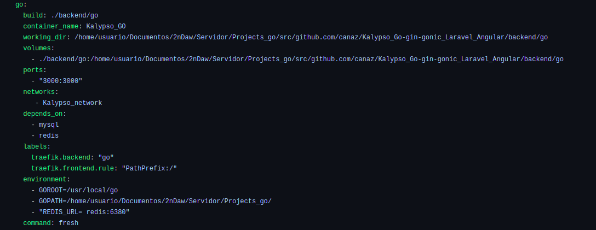
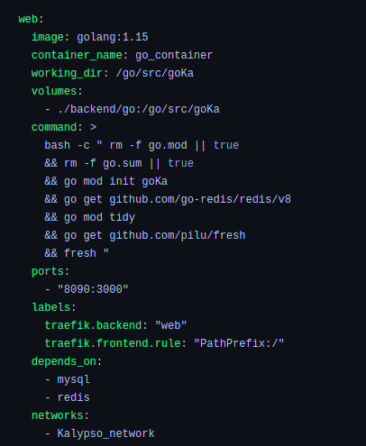
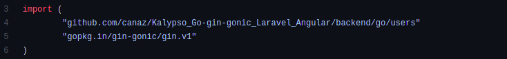
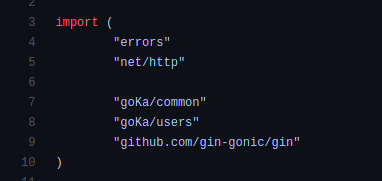

# KALYPSO APP | VICENT COLL Y ALEX ZARAZUA

**INDEX**

  * Tecnologías Implicadas :

    * GO
    * LARAVEL
    * REDIS 
    * TRAEFIK
    * ANGULAR 
    * PROMETHEUS
    * GRAFANA

  * Proceso de Desarrollo

# Tecnologías Implicadas 

## Lenguaje de Backend Go

 **Go o Golang** es un lenguaje de programación de código abierto creado por Google  en 2009 y que ayuda en la creación de software de manera fácil, eficiente y de alto rendimiento.

_A pesar de ser un lenguaje muy joven tiene un rendimiento similar a C pero con la sintaxis amigable parecida a Python, actualmente es utilizado en aquellos programas que requieran alto rendimiento y un ejemplo de ello es Docker_

* VENTAJAS DE GO

    * Velocidad similar a C pero con una sintaxis amigable como Python.
    * Facilita el uso de buenas prácticas en el código.
    * Mantiene su rendimiento con grandes volúmenes de información.
    * Su curva de aprendizaje es suave en comparación con Java o C.
    * Es un lenguaje multiparadigma.

 Una de las principales funciones de _Golang_ es que maneja las múltiples tareas de forma concurrente, es decir, que el procesador divide el trabajo en múltiples hilos y a cada uno le dedica un tiempo en milisegundos acelerando el tiempo de ejecución en cada tarea sin necesidad de realizar configuraciones adicionales ya que _Golang_ lo traen en sus librerías preinstaladas.

 La manera como _Golang_ trabaja esto es a través de Goroutines y Canales. Puedes tener múltiples Goroutines por canal y transportar el Goroutine de un canal a otro. Un excelente uso de Goroutines es al momento de trabajar transferencia de datos en tiempo real desde un cliente a otro, como por ejemplo un chat o un sistema de ubicación en tiempo real.

###  Frameworks populares

     Echo ->  Minimalista, escalable y de alto rendimiento y si lo combinas con Fresh podrás hacer que cada cambio guardado se recompile y ejecute.

     Revel -> Es bastante completo para hacer proyectos complejos.

     Gin -> Es rápido en su ejecución e ideal para hacer prototipos de de microservicios RESTful API.

## Lenguaje de Backend Laravel

**Laravel** es un framework open-source de PHP desarrollado por el MIT en 2011. Su principal objetivo es _simplificar y estilizar el código y que sea más sencillo de leer, interpretar y programar, virtud de la que carecía la programación del lenguaje nativo PHP._

Consigue su objetivo gracias a componentes y dependencias,con el transcurso de los años ha conseguido crear dependencias propias mejorando las de otros frameworks. Muchas de estas dependencias son del pionero francés Symfony.

Así como lo era y es para PHP, el principal target de Laravel son las páginas y aplicaciones web.

### Puntos fuertes de hacer un backend con Laravel

    Documentación --> Si es verdad que para un programador junior o 
     principiante la palabra framework asusta, en Laravel no.
     Su documentación oficial es de las más completas, de las más simples y de las mejor explicadas --> https://laravel.com .

    Eloquent ORM --> Cómo ha sido nombrado anteriormente, este súper-paquete de Laravel
     nos permite sustituir las consultas SQL y de MongoDB por una simple Programación Orientada a Objetos.
     De este modo, Eloquent se encarga de convertir nuestros objectos a queries para cualquiera de las bases de datos que acepta.

    Routing o rutas -->  Si bien en Node.js, por convención, las rutas se definen por entidades o modelos 
    en ficheros separados, en Laravel los endpoints se agrupan por funcionalidades
     de la aplicación (web.php si es en un entorno web o api.php si es para una API),
     para poder organizar mejor las rutas de nuestra aplicación.
    Además, nos da la posibilidad de agrupar las rutas, permitiéndonos así asignarles prefijos, sufijos y middlewares.

    Middlewares más sencillos --> Son controladores que se ejecutan antes o después de una petición 
    para evitar repetirlos en nuestras funciones sistemáticamente.
    Laravel nos da ejemplos y una estructura para aprender como usarlos. 
    Los más comunes son las autenticaciones de tokens de sesión, los permisos de un usuario, etc.

    La consola artisan -->  Laravel incorpora el cli artisan, que nos permite en comandos muy lógicos
    y sencillos realizar acciones que otros frameworks no nos permiten, 
    como crear ficheros (modelos, controladores, providers …), limpiar la cache, etc. 
    En definitiva, una maravilla, 
    no tenemos que tenerle miedo a la terminal, es nuestra amiga --> https://laravel.com/docs/7.x/artisan 

## Redis

**Redis** es un rápido almacén de datos clave-valor en memoria de código abierto que se puede utilizar como base de datos, caché, agente de mensajes y cola.

### ¿Cómo funciona Redis?

Todos los datos de Redis residen en la memoria, a diferencia de las bases de datos que almacenan datos en discos o SSD. 
Como no hay ninguna necesidad de obtener acceso al disco, los almacenes de datos en memoria, como Redis, evitan los retrasos y pueden obtener acceso a los datos en cuestión de milisegundos.Lo que simplifica la creación de aplicaciones a escala de Internet en tiempo real.

## Traefik

**Traefik** es un proxy inverso y un balanceador HTTP y TCP escrito en GO , compatible con Docker y Kubernetes,
que ofrece un conjunto de características muy interesantes:

  *  Auto-descubrimiento de servicios

  *  Tracing

  *  Métricas

## Angular 

**Angular** es un framework de desarrollo para JavaScript creado por Google. 
La finalidad de Angular es facilitarnos el desarrollo de aplicaciones web SPA (Single Page Aplication)
y además darnos herramientas para trabajar con los elementos de una web de una manera más sencilla y optima.

Otro propósito que tiene Angular es la separación completa entre el front-end y el back-end en una aplicación web.

Una _SPA_ es una web de una sola página, 
en la cual la navegación entre secciones y páginas de la aplicación, 
así como la carga de datos, se realiza de manera dinámica, 
casi instantánea, asincronamente haciendo llamadas al servidor (backend con un API REST)
y sobre todo sin refrescar la página en ningún momento.

## Prometheus

**Prometheus** es una aplicación que nos permite recoger métricas de una aplicación en tiempo real. Como veréis en el ejemplo de app.js, se incluye una dependencia en el código ( prom-client) que permite crear contadores de peticiones que podemos asociar fácilmente a nuestros endpoints de manera que podemos saber cuántas veces se ha llamado a una función de nuestra api.

## Grafana

 * **Grafana** es un software libre basado en licencia de Apache 2.0, ​ que permite la visualización y el formato de datos métricos. Permite crear cuadros de mando y gráficos a partir de múltiples fuentes, incluidas bases de datos de series de tiempo como Graphite, InfluxDB y OpenTSDB.

 * Además de las utilidades mencionadas con anterioridad, recalcar que la herramienta también nos permite consultar información de negocio, como es el gasto en infraestructura en tiempo real, e incluso integrar gráficas de negocio del propio cliente.

* Todo ello posiciona al cliente ante una situación muy favorable de cara a poder gestionar de forma eficiente su infraestructura y servicios, permitiéndole anticipar posibles incidencias y reducir costes.

*   *También recalcar que está escrito en Go.*

# Proceso de Desarrollo

La primera parte del proyecto fue refactorizar el backend de Go para que esta pase a utilizar módulos go.

Para ello lo que hicimos fue modificar el servicio de go del docker-compose que teniamos.

El que teniamos era el siguiente :

Y las modificaciones que hicimos fueron : 

  * Cambiamos el nombre de go a web 
  * Eliminamos el dockerfile que teniamos en el servidor de go,
    de manera que el pull de la imagen de go , más las sentecias de comandos las pasamos
    al docker-compose.
  * Además el nombre del working_dir paso a llamarse -> /go/src/goKa ya que
    es el nombre que le pusimos a los modulos de go.
  * Y por último eliminamos los enviroments de redis ya que no eran de utilidad.
 
 De tal manera que el servicio web en el docker-compose quedaría asi : 

  

Seguidamente, dentro del servidor Go, en todos los imports utilizados las rutas las cambiamos 
de 
  * --> ` "github.com/canaz/Kalypso_Go-gin-gonic_Laravel_Angular/backend/go/common" `  

    

a la siguiente : 

  * -->  ` "goKa/common" `

    

Como muestro anteriormente en el docker-compose que nuestro directorio del servicio de go lo llamamos goKa, podemos utilizar
las rutas de los archivos como goKa en lugar de la ruta de los directorios del proyecto.

**_Sin olvidar que hemos tenido que cambiar la version del frammework de gingonic ya que la anterior que estabamos utilizando estaba deprecated , pasando de ` gopkg.in/gin-gonic/gin.v1 ` a  ` github.com/gin-gonic/gin ` _**

 * 

## MICROSERVICIOS EN EL BACKEND DE GO

El siguiente ejercico fue el de refactorizar el backend de **Go** para que de esta manera los modulos pasen a ser **microservicios** , cada uno independiente.

Para ello, en primer lugar, lo que hicimos fue una restructuración de los directorios de cada microservicio , además de añadir por cada microservicio su correspondiente servicio en el docker-compose, en nuestro caso no hicimos un dockerfile por cada microservicio, sino que todos los comandos necesarios los añadimos al docker-compose, como teniamos anteriormente con el Backend de Go.

De tal manera que la estructura de cada microservicio nos quedo asi : 

  ### Microservicios de Products

| Nombre | Descripción |
| - | - |
| common | Donde se encuentran los archivos de configuración de cada microservicio.|
| common/database.go | Con las funciones de la creación de la bases de datos y sus sesiones. |
| common/utils.go | Otras funciones comunes como es el la generación del token JWT |
| src/middlewares.go | Funciones que utilizan el token JWT, como es la de extraerlo y darle autorización al usuario |
| src/models.go | Estructura de modelos utilizados en la App, Usuarios, Products y Buys_Products  |
| src/routers.go | Una vez comprobado el models mediante los serializers y validators lo enviamos a la parte cliente |
| src/serializers.go | Donde transformarmos los  datos de formatos más propios  de Model  como puedan ser JSON  o XML |
| src/vallidators.go | Implementa validaciones de valor para estructuras y campos individuales  |
